# 目录：

[TOC]

# 深度学习

## 1. 训练

### 1. 1 为什么用交叉熵损失函数？

https://blog.csdn.net/huwenxing0801/article/details/82791879

概念：信息量、信息熵、相对熵、交叉熵

梯度下降的目的，直白地说：是减小真实值和预测值的距离，而损失函数用来度量真实值和预测值之间距离

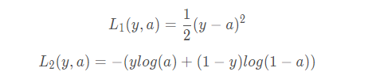

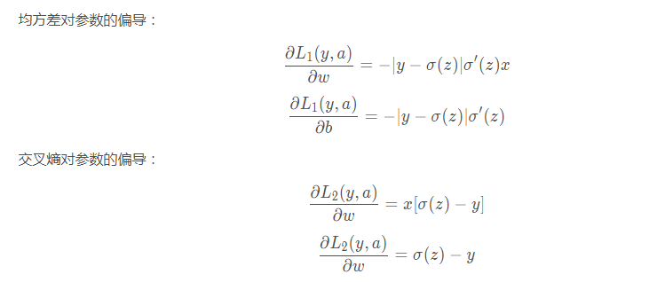

从以上公式可以看出：均方差对参数的偏导的结果都乘了sigmoid的导数，而sigmoid导数在其变量值很大或很小时趋近于0，所以偏导数很有可能接近于0。可知，偏导很小时，参数更新速度会变得很慢，而当偏导接近于0时，参数几乎就不更新了。

反观交叉熵对参数的偏导就没有sigmoid导数，所以不存在这个问题。这就是选择交叉熵而不选择均方差的原因

[回到顶部](# 目录：)

### 1.2 交叉熵损失的求导

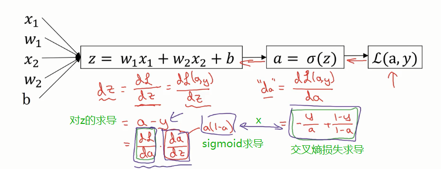

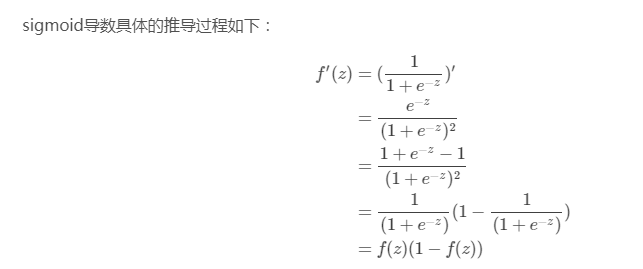

三个重点求导记住：

1）对sigmoid激活a的求导：a(1-a)       a = f(z)

2）对乘加操作z的求导：a-y         y是标签    ★★★★

3）对权重w的求导：x(a-y)

推荐博客：https://blog.csdn.net/zhishengqianjun/article/details/75303820

[回到顶部](# 目录：)

### 1.3 怎么防止过拟合和欠拟合？

**过拟合：**

1. **数据集**上：获取更多的数据，添加噪声数据，将数据集分为训练集、交叉验证集、测试集

2. batch normalization（慎说）

3. **正则化：**

   1）参数正则化方法：L1和L2正则化

   2）经验正则化方法：dropout，提前停止（early stopping）

**欠拟合：**

1. 添加其他特征项。组合、泛化、相关性、上下文特征、平台特征等特征是特征添加的重要手段，有时候特征项不够会导致模型欠拟合。
2. 可以增加模型的复杂程度。
3. 减小正则化系数。正则化的目的是用来防止过拟合的，但是现在模型出现了欠拟合，则需要减少正则化参数。

[回到顶部](# 目录：)

### 1.4 L1和L2正则化

也可以称之为权重衰减(weight decay)

什么是正则化？所谓正则化，它的目标就是要同时让**经验风险**和**模型复杂度**较小。

https://mp.weixin.qq.com/s/-vmQpmrIfYCwp_ttoLbAJg

https://blog.csdn.net/program_developer/article/details/80867468

L1-最小绝对偏差(LAD)和L2-最小二乘误差(LS)，

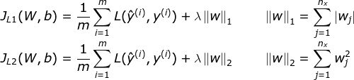

lambda是**正则化系数**，也可以是**正则化率**，也可以是**衰减率**，非常小，在选择其值时，试图在模型的简单性和拟合训练数据之间达到最佳点。n是样本大小。代价函数：

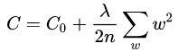

求导： 对b没有影响

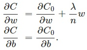

参数更新： 可以看出，w更新前，会先衰减一点点

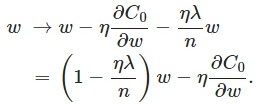

**正则化作用：**

（1）从模型的复杂度上解释：更小的权值w，从某种意义上说，表示网络的**复杂度更低**，对数据的拟合更好（这个法则也叫做奥卡姆剃刀），而在实际应用中，也验证了这一点，L2正则化的效果往往好于未经正则化的效果。（2）从数学方面的解释：过拟合的时候，拟合函数的**系数往往非常大**，为什么？就是拟合函数需要顾忌每一个点，最终形成的拟合函数波动很大，这就造成过拟合。在某些很小的区间里，函数值的变化很剧烈。这就意味着函数在某些小区间里的导数值（绝对值）非常大，由于自变量值可大可小，所以只有系数足够大，才能保证导数值很大。而正则化是通过**约束参数的范数使其不要太大**，所以可以在一定程度上减少过拟合情况。

**L1 正则的规范化目标是造成参数的稀疏化，就是争取达到让大量参数值取得 0 值的效果，而 L2 正则的规范化目标是有效减小原始参数值的大小**。

假定你的数据分布是稀疏的，就用L1正则

周志华西瓜书253页
总结一点就是
L1范数有棱角，和优化目标函数相切的点在各分量上要么有值要么为0
L2范数比较圆滑，喜欢每个分量上都分一点，比起L1，L2更加平滑稳定

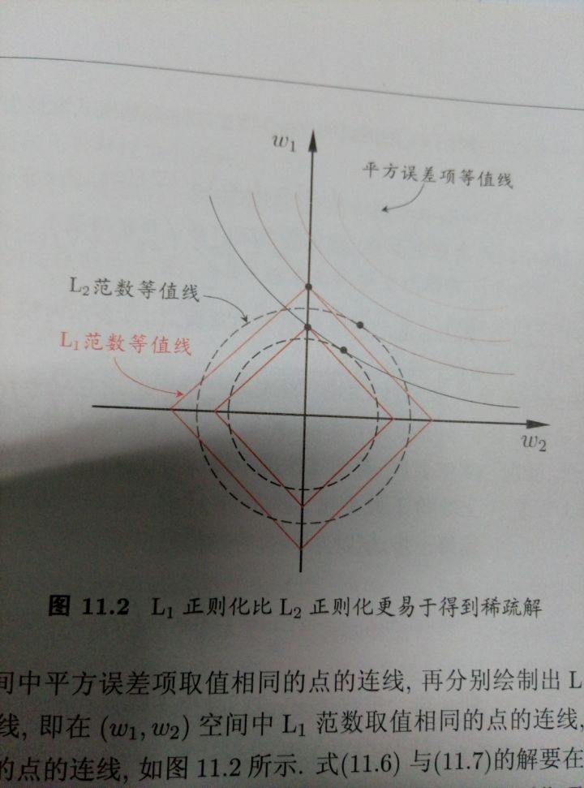

[回到顶部](# 目录：)

### 1.5 Batch Normalization

一个batch通过一个神经元，得到的值，然后计算的均值和方差（如果是原始输入值，计算在该神经元上输入的均值方差）。有几个神经元，就有几组均值和方差。

'decay' 滑动平均
'center' β
'scale' γ
'epsilon' 计算方差时加入的 防止为零

对每个元素进行归一化后，再进行尺度缩放和偏移操作，这样可以变换回原始的分布，实现恒等变换，这样的目的是为了**补偿网络的非线性表达能力**，因为经过标准化之后，偏移量丢失。具体的表达如下：
$$
y_i = \gamma_i \cdot x^{'}_i+\beta_i
$$
 $x^{'}_i$ 为零均值归一化后的值。由于归一化后的值基本会被限制在正态分布下，使得网络的表达能力下降。为解决该问题，引入两个新的参数：γ,β.

假如gamma等于方差，beta等于均值，就实现了恒等变换。从某种意义上来说，gamma和beta代表的其实是**输入数据分布的方差和偏移**。对于没有BN的网络，这两个值与前一层网络带来的非线性性质有关，而经过变换后，就跟前面一层无关，变成了当前层的一个学习参数，这更加有利于优化并且不会降低网络的能力。

CNN中BN的操作是在**各个特征维度之间单独进行**，也就是说各个通道是分别进行Batch Normalization操作的。如果输出的blob大小为(N,C,H,W)，那么在每一层normalization就是基于NxHxW个数值进行求平均以及方差的操作。

https://mp.weixin.qq.com/s/GcyuYOIZLvGfq4_FoVDbUA

https://blog.csdn.net/u010899985/article/details/82251932

**BN带来的好处：**

(1) 减轻了对参数初始化的依赖，利于调参，使网络学习更加稳定。

(2) 调整了数据的分布，它让每一层的输出归一化到了均值为0方差为1的分布，这保证了梯度的有效性

(3) 加速训练，可以使用更高的学习率。

(4) BN一定程度上增加了泛化能力，具有一定的正则化效果，dropout等技术可以去掉。

**BN的缺陷**

batch normalization依赖于batch的大小，当batch值很小时，计算的均值和方差不稳定。

**BN训练测试的区别**

训练时，用的是批数据的均值和方差

训练结束后，对整个训练集计算了所有批数据的mean和var的平均无偏估计（也可以滑动平均），

作为最终的mean和var存储到了模型中。测试的时候直接从模型中读取mean和var进行计算。

**BN为什么可以加速收敛？**

在深层网络训练的过程中，由于网络中参数变化而引起内部结点数据分布发生变化

（1）上层网络需要不停调整来**适应输入数据分布的变化**，导致网络学习速度的降低

（2）网络的训练过程容易陷入**梯度饱和区**，参收更新变慢，减缓网络收敛速度

**BN为什么可以代替dropout？**

在Batch Normalization中，由于我们使用mini-batch的均值与方差作为对整体训练样本均值与方差的**估计**，尽管每一个batch中的数据都是从总体样本中抽样得到，但不同mini-batch的均值与方差会有所不同，这就为网络的学习过程中**增加了随机噪音**，与Dropout通过关闭神经元给网络训练带来噪音类似，在一定程度上对模型起到了正则化的效果。

参考：https://zhuanlan.zhihu.com/p/34879333

[回到顶部](# 目录：)

### 1.6 几种normalization方法

先说下两种**归一化**：

1. **线性归一化**：$y_i = \frac{x_i-x_{min}}{x_{max}-x_{min}}$
2. **零均值归一化/Z-score标准化**：$y_i = \frac{x_i-\mu}{\sigma}$

**为什么要归一化？**

1. 为了后面数据处理的方便，归一化的确可以避免一些不必要的数值问题。
2. 为了程序运行时收敛加快。
3. 同一量纲。样本数据的评价标准不一样，需要对其量纲化，统一评价标准。这算是应用层面的需求。
4. 避免神经元饱和。啥意思？就是当神经元的激活在接近 0 或者 1 时会饱和，在这些区域，梯度几乎为 0，这样，在反向传播过程中，局部梯度就会接近 0，这会有效地“杀死”梯度。
5. 保证输出数据中数值小的不被吞食。 

Batch Normalization是NxHxW，Layer Normalization是CxHxW，Instance Normalization是HxW，Group Normalization是GxHxW

**Layer Normalization**

抛弃对batch的依赖，也就是每一个样本都单独进行normalization，同时各个通道都要用到。跟Batch Normalization仅针对单个神经元不同，Layer Normalization**考虑了神经网络中一层的神经元**

**Instance Normalization**


**Group Normalization**


[回到顶部](# 目录：)

### 1.7 几种优化器

SGD Momentum Adagrad Adadelta RMSprop Adam

https://blog.csdn.net/fzp95/article/details/83018744

强推：https://blog.csdn.net/u012328159/article/details/80311892

**1. SGD**

缺点：SGD并不是每次迭代都向着整体最优化方向，会造成严重的震荡。虽然包含一定的随机性，但是从期望上来看，它是等于正确的导数的。

**2. SGD with momentum**

在更新参数时加入了**指数加权平均**，momentum越大，之前梯度对现在的方向影响越大。

```python
momentum = 0.9
vdW = 0
vdb = 0
for i in range(num_iter):
    vdW = momentum*vdW + (1 - momentum)*grads['W']
    params['W'] -= learning_rate*vdW

    vdb = momentum*vdb + (1 - momentum)*grads['b']
    params['b'] -= learning_rate*vdb
```

**3. AdaGrad**

每一次更新参数时，不同的参数使用不同的学习率

优点：对于梯度较大的参数，$G_t$相对较大，则$\frac{\alpha}{\sqrt{G_t + \epsilon}}$较小，意味着学习率会变得较小。而对于梯度较小的参数，则效果相反。这样就可以使得参数在平缓的地方下降的稍微快些，不至于徘徊不前。

缺点：由于是累积梯度的平方，到后面$G_t$累计的比较大，会导致$\frac{\alpha}{\sqrt{G_t + \epsilon}}\rightarrow0$，导致梯度消失。

```python
for i in range(num_iter):
    G_W = grads['W']**2
    params['W'] -= learning_rate*grads['W']/(np.sqrt(G_W) + epsilon)

    G_b = grads['b']**2
    params['b'] -= learning_rate*grads['b']/(np.sqrt(G_b) + epsilon)
```

**4. Adadelta**


**5. RMSprop**

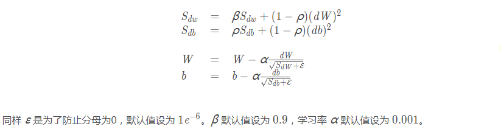

原作者的公式中$\rho$写错，应为 $\beta$

**6.  Adam**

动量的vdW，RMSprop的sdW带了偏差修正，两者结合

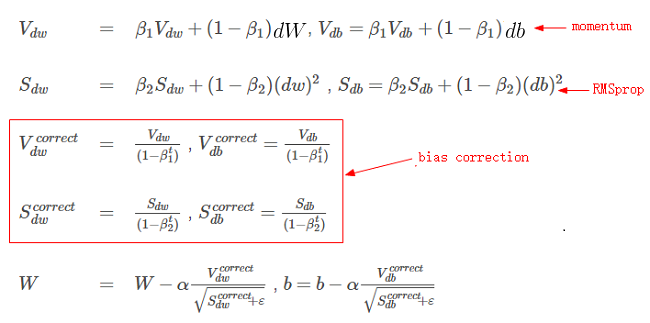


https://www.cnblogs.com/guoyaohua/p/8542554.html

https://blog.csdn.net/qq_38622495/article/details/82689885

http://zh.gluon.ai/chapter_optimization/momentum.html

[回到顶部](# 目录：)

### 1.8 几种学习率衰减方法

https://blog.csdn.net/fzp95/article/details/85008413

https://blog.csdn.net/zxyhhjs2017/article/details/82383723

1. **指数衰减** exponential_decay

   `decay_rate`越**小**，下降越快

```
decayed_learning_rate = learning_rate *
                          decay_rate ^ (global_step / decay_steps)
```

2. **自然指数衰减** exponential_time_decay

   `decay_rate`越**大**，下降越快

```
decayed_learning_rate = learning_rate * exp(-decay_rate * global_step)
```

3. **多项式衰减** polynomial_decay

   `learning_rate`在`decay_steps`步内，到达`end_learning_rate`。`power`为1时是一阶下降，可以cycle

```
decayed_learning_rate = (learning_rate - end_learning_rate) *
                          (1 - global_step / decay_steps) ^ (power) +end_learning_rate
```

4. **余弦衰减** cosine_decay

等等

[回到顶部](# 目录：)

### 1.9 几种参数初始化方法

1. **标准初始化** 高斯初始化

标准正态分布和截断正态分布 保证固定的均值和标准差

截断正态分布(Truncated_normal)保证值在（μ-2σ，μ+2σ）之间

2. Xavier初始化


3. He初始化


https://mp.weixin.qq.com/s/rHCl3fT7FS-TF1-WafjL3Q

[回到顶部](# 目录：)

### 1.10 几种损失函数

**1. log对数损失函数（逻辑回归）**

逻辑回归的推导中，它假设样本服从伯努利分布（0-1分布），然后求得满足该分布的似然函数，接着取对数求极值
$$
L(Y,P(Y|X)) = -\log P(Y|X)
$$
损失函数L(Y, P(Y|X))表达的是样本X在分类Y的情况下，使概率P(Y|X)达到最大值（换言之，**就是利用已知的样本分布，找到最有可能（即最大概率）导致这种分布的参数值；或者说什么样的参数才能使我们观测到目前这组数据的概率最大**）

**2. Hinge 损失函数（SVM）**
$$
L(y) = \max(0, 1-y\tilde{y}), y=\pm 1
$$
**3. Huber loss（smooth L1）**

相比于最小二乘的线性回归，HuberLoss降低了对离群点的惩罚程度
$$
\begin{split}
L_\delta(a)=\left \{
\begin{array}{ll}
\frac12a^2,&\textrm{for } |a|\leq\delta,\\
\delta\cdot(|a|-\frac12\delta),&\textrm{otherwise.}
\end{array}
\right.
\end{split}
$$
当预测偏差小于 δ 时，它采用平方误差，当预测偏差大于 δ 时，采用的线性误差。当δ为1时，就是smooth L1 loss


[回到顶部](# 目录：)

### 1.11 为什么需要非线性激活函数？

**为什么需要激活函数？**

1. 激活函数可以引入**非线性因素**。如果不使用激活函数，则输出信号仅是一个简单的线性函数。线性函数一个一级多项式，线性方程的复杂度有限，从数据中学习复杂函数映射的能力很小。没有激活函数，神经网络将无法学习和模拟其他复杂类型的数据，例如图像、视频、音频、语音等。
2. 激活函数可以把当前特征空间通过一定的线性映射转换到另一个空间，让数据能够更好的被分类。

**为什么激活函数需要非线性函数？**

1. 假若网络中全部是线性部件，那么线性的组合还是线性，与单独一个线性分类器无异。这样就做不到用非线性来逼近任意函数。
2. 使用非线性激活函数 ，以便使网络更加强大，增加它的能力，使它可以学习复杂的事物，复杂的表单数据，以及表示输入输出之间非线性的复杂的任意函数映射。使用非线性激活函数，能够从输入输出之间生成非线性映射。

**激活函数有哪些性质？**

1. 非线性： 当激活函数是线性的，一个两层的神经网络就可以基本上逼近所有的函数。但如果激活函数是恒等激活函数的时候，即 $ f(x)=x $，就不满足这个性质，而且如果 MLP 使用的是恒等激活函数，那么其实整个网络跟单层神经网络是等价的；
2. 可微性： 当优化方法是基于梯度的时候，就体现了该性质；
3. 单调性： 当激活函数是单调的时候，单层网络能够保证是凸函数；
4. $ f(x)≈x $： 当激活函数满足这个性质的时候，如果参数的初始化是随机的较小值，那么神经网络的训练将会很高效；如果不满足这个性质，那么就需要详细地去设置初始值；
5. 输出值的范围： 当激活函数输出值是有限的时候，基于梯度的优化方法会更加稳定，因为特征的表示受有限权值的影响更显著；当激活函数的输出是无限的时候，模型的训练会更加高效，不过在这种情况小，一般需要更小的 Learning Rate。

[回到顶部](# 目录：)

### 1.11 几种激活函数及其导数

对常见激活函数，导数计算如下：


### 1.12 指定训练用GPU

两种方法

1. 终端指定：

   `CUDA_VISIBLE_DEVICES=0 python train.py` 或 `export CUDA_VISIBLE_DEVICES=1`

2. 代码中指定：

   ```python
   import os
   os.environ["CUDA_VISIBLE_DEVICES"] = "1"
   ```

   ```python
   c = []
   for d in ['/gpu:0', '/gpu:1']:
     with tf.device(d):
       a = tf.constant([1.0, 2.0, 3.0, 4.0, 5.0, 6.0], shape=[2, 3])
       b = tf.constant([1.0, 2.0, 3.0, 4.0, 5.0, 6.0], shape=[3, 2])
       c.append(tf.matmul(a, b))
   with tf.device('/cpu:0'):
     sum = tf.add_n(c)
   # Creates a session with log_device_placement set to True.
   sess = tf.Session(config=tf.ConfigProto(log_device_placement=True))
   # Runs the op.
   print sess.run(sum)
   ```

https://blog.csdn.net/sinat_30372583/article/details/79857628

[回到顶部](# 目录：)

### 1.13 maxpooling 怎么反向传播

CNN中一些特殊环节的反向传播：https://blog.csdn.net/qq_21190081/article/details/72871704

max pooling和mean pooling不同，max pooling需要记录下最大值的id，反向传播时传给这个id

https://blog.csdn.net/Jason_yyz/article/details/80003271

### 1.14 梯度消失和梯度爆炸的原因和解决

**梯度消失：**

1. 不合适的激活函数 ---> relu
2. 网络太深 ---> 残差模块
3. 数据分布没有归一化  ---> BN

**梯度爆炸：**

梯度在网络更新的过程中不断累积，变成非常大的梯度，导致网络权重值的大幅更新，使得网络不稳定；在极端情况下，权重值甚至会溢出，变为NaN值，再也无法更新

### 1.15 感受野计算

https://blog.csdn.net/Kerrwy/article/details/82430530

[回到顶部](# 目录：)

### 1.16 正负样本不均衡时的解决方案

1. 重采样，采样主要包括上采样（oversampling，有的称为过采样）和下采样（undersampling，有的称为降采样）
2. 数据合成，利用已有样本来生成更多的样本，这种方法在小数据场景下有很多成功案例。
3. 除了采样和生成新数据等方法，还可以通过加权的方式来解决数据不平衡问题，即对不同类别分错的代价不同

**上采样：**通过将小众类样本复制多份，来得到多个不同数据集的方式，每个数据集训练一个模型。

**下采样：**从大众类众剔除一些样本，或者只从大众类样本中选取部分样本。多次下采样（放回采样，产生多个相互独立的数据集），进而训练多个不同的分类器，通过组合多个分类器的结果进而得到最终的结果，这种方式称为EasyEnsemble。


### 1.17  加速网络收敛

BN

优化器

大学习率

[回到顶部](# 目录：)

## 2. 数据

### 2.1 数据扩增的方法

随机裁剪

平移

翻转（水平 垂直）

旋转

缩放

颜色变换（明暗 对比度 饱和度）

[回到顶部](# 目录：)

### 2.2 怎么发现不好的数据？

先扔到网络里训练，等损失平稳后，把batch size调为1，看那些样本损失大，对这些样本修改标签、再训练。

或者等网络训练平稳后，保存网络，然后测试一遍训练集上的数据，观看每个样本的预测结果。

### 2.3 什么样的数据集不适合用深度学习?

**数据集太小**，数据样本不足时，深度学习相对其它机器学习算法，没有明显优势。
数据集**没有局部相关特性**，目前深度学习表现比较好的领域主要是图像／语音／自然语言处理等领域，这些领域的一个共性是局部相关性。图像中像素组成物体，语音信号中音位组合成单词，文本数据中单词组合成句子，这些特征元素的组合一旦被打乱，表示的含义同时也被改变。对于没有这样的局部相关性的数据集，不适于使用深度学习算法进行处理。举个例子：预测一个人的健康状况，相关的参数会有年龄、职业、收入、家庭状况等各种元素，将这些元素打乱，并不会影响相关的结果。

[回到顶部](# 目录：)

### 2.4 resize的方法

以cv2.resize()为例：

| interpolation 选项 | 所用的插值方法                                               |
| :----------------- | :----------------------------------------------------------- |
| INTER_NEAREST      | 最近邻插值                                                   |
| INTER_LINEAR       | 双线性插值（默认设置）                                       |
| INTER_AREA         | 使用像素区域关系进行重采样。 它可能是图像抽取的首选方法，因为它会产生无云纹理的结果。 但是当图像缩放时，它类似于INTER_NEAREST方法。 |
| INTER_CUBIC        | 4x4像素邻域的双三次插值                                      |
| INTER_LANCZOS4     | 8x8像素邻域的Lanczos插值                                     |

https://www.cnblogs.com/amarr/p/10565188.html

[回到顶部](# 目录：)

## 3. 代码

### 3.1 手写MNIST分类

**Keras:**

用到的几个模块：

keras.datasets:  mnist.load_data()

keras.models: Sequential()

keras.layers: Conv2D, Maxpooling2D, Dropout, Flatten, Dense 

K.image_data_format()

keras.utils.to_categorical(x_train, num_classes)

````python
import keras
from keras.datasets import mnist
from keras.models import Sequential
from keras.layers import Conv2D, MaxPooling2D, Dense, Dropout, Flatten
from keras import backend as K

K.image_data_format() == 'channels_first':

batch_size = 128
num_classes = 10
epochs = 12

#############
#  准备数据  #
#############
(x_train, y_train), (x_test, y_test) = mnist.load_data()

# input image dimensions
img_rows, img_cols = 28, 28

x_train = x_train.reshape(x_train.shape[0], img_rows, img_cols, 1)
x_test = x_test.reshape(x_test.shape[0], img_rows, img_cols, 1)

x_train = x_train.astype('float32')
x_test = x_test.astype('float32')
x_train /= 255
x_test /= 255
print('x_train shape:', x_train.shape)
print(x_train.shape[0], 'train samples')
print(x_test.shape[0], 'test samples')

# convert class vectors to binary class matrices
y_train = keras.utils.to_categorical(y_train, num_classes)
y_test = keras.utils.to_categorical(y_test, num_classes)

input_shape = (img_rows, img_cols, 1)

model = Sequential()
model.add(Conv2D(32, kernel_size=(3, 3),
                 activation='relu',
                 input_shape=input_shape))  # 3x3卷积
model.add(Conv2D(64, (3, 3), activation='relu'))  # 3x3卷积
model.add(MaxPooling2D(pool_size=(2, 2)))  # 最大池化
model.add(Dropout(0.25))  # dropout在全连接之前添加
model.add(Flatten())
model.add(Dense(128, activation='relu'))  # 全连接
model.add(Dropout(0.5))
model.add(Dense(num_classes, activation='softmax'))  # 全连接输出预测

model.compile(loss=keras.losses.categorical_crossentropy,
              optimizer=keras.optimizers.Adadelta(),
              metrics=['accuracy'])
model.fit(x_train, y_train,
          batch_size=batch_size,
          epochs=epochs,
          verbose=1,
          validation_data=(x_test, y_test)）
````

**Tensorflow:**

```python
import tensorflow as tf
from tensorflow.examples.tutorials.mnist import input_data
from tensorflow.examples.tutorials.mnist import mnist
import tensorflow.contrib.slim as slim
 
mnist=input_data.read_data_sets('MNIST_DATA',one_hot=True)
x=tf.placeholder("float",shape=[None,784])
y_=tf.placeholder("float",shape=[None,10])
 
#cast x to 3D
x_image=tf.reshape(x,[-1,28,28,1])#shape of x is [N,28,28,1]

#conv layer1
net=slim.conv2d(x_image,32,[3,3],scope='conv1')#shape of net is [N,28,28,32]
#conv layer2
net=slim.conv2d(net,64,[3,3],scope='conv2')#shape of net is [N,28,28,64]
net=slim.max_pool2d(net,[2,2],scope='pool2')#shape of net is [N,14,14,64]
 
#reshape for full connection
net=tf.reshape(net,[-1,14*14*64])#[N,14*14*64]
#fc1
net=slim.fully_connected(net,1024,scope='fc1')#shape of net is [N,1024]
#dropout layer
keep_prob=tf.placeholder('float')
net=tf.nn.dropout(net,keep_prob)
#fc2
net=slim.fully_connected(net,10,scope='fc2')#[N,10]
#softmax
y=tf.nn.softmax(net)#[N,10]
 
cross_entropy=-tf.reduce_sum(tf.multiply(y_,tf.log(y)))#y and _y have same shape.
l2_loss = tf.add_n([tf.nn.l2_loss(w) 
                    for w in tf.get_collection(tf.GraphKeys.TRAINABLE_VARIABLES)])
total_loss = cross_entropy + 7e-5*l2_loss

train_step=tf.train.AdamOptimizer(1e-4).minimize(cross_entropy)

# 验证训练的模型
correct_prediction = tf.equal(tf.argmax(out, 1), tf.argmax(y, 1))
accuracy = tf.reduce_mean(tf.cast(correct_prediction, tf.float32))

init=tf.global_variables_initializer()
with tf.Session() as sess:
    sess.run(init)
    for i in range(3000):
        batch_x, batch_y=mnist.train.next_batch(128)
        _, loss, l2_loss_value, total_loss_value = sess.run(
            [train_step, cross_entropy, l2_loss, total_loss],
            feed_dict={x: batch_x, y: batch_y, keep_prob: 0.5})
        if i%100==0:
            print("step %d, entropy loss: %f, l2_loss: %f, total loss: %f" %
                  (step+1, loss, l2_loss_value, total_loss_value))
            print("Train accuracy:", sess.run(accuracy, feed_dict={x: batch_x, 
                                                 y: batch_y, keep_prob:1.0}))
 
    total_accuracy=sess.run(accuracy,feed_dict={x:mnist.test.images,
                                                y_:mnist.test.labels,keep_prob:1.0})
    print("Text accuracy:", total_accuracy)

```

### 3.1 mobilenet V1

https://blog.csdn.net/zj360202/article/details/78623567

### 3.2 用numpy实现分类器

https://github.com/zlpure/CS231n

**CNN:**

https://github.com/zlpure/CS231n/blob/master/assignment2/cs231n/classifiers/cnn.py

### 3.3 tf.name_scope()和tf.variable_scope()

这两种作用域，对于使用`tf.Variable()`方式创建的变量，具有相同的效果，**都会在变量名称前面，加上域名称**。对于通过`tf.get_variable()`方式创建的变量，只有variable_scope名称会加到变量名称前面，而name_scope不会作为前缀。

**命名域**

`tf.name_scope()`主要是方便参数变量的“ 分组 ”和 “ 管理 ”，主要是结合`tf.Variable()`一起使用

```python
tf.name_scope(name,default_name=None,values=None)
```

values这个参数的规定了应该把在`with tf.name_scope`区域里生成的tensor放到哪个计算图（graph）里

比如：

```python
graph_tensor = tf.Graph()
with graph_tensor.as_default():
    A = tf.constant(1)
 
graph_1 = tf.Graph()
graph_1.as_default()
with tf.name_scope(None, "namescope_1"):
    op1 = tf.constant(0)
 
graph_2 = tf.Graph()
graph_2.as_default()
with tf.name_scope(None, "namescope_2",[A]):
    op2 = tf.constant(0)
 
print(op1.graph == graph_tensor) # 输出 false
```

小结：name_scope不会作为`tf.get_variable`变量的前缀，但是会作为`tf.Variable`的前缀。

**变量域**

`tf.variable_scope()`一方面也是可以实现变量的“ 分组 ”和“ 管理 ”，主要是结合`tf.get_variable()`一起使用

```python
tf.variable_scope(name,default_name=None,values=None,initializer=None,regularizer=None,caching_device=None,partitioner=None,custom_getter=None,reuse=None,dtype=None)
```

例子：

```python
with tf.variable_scope("my_variable_scope"):
    v1 = tf.get_variable("var1", [1], dtype=tf.float32)
    v2 = tf.Variable(1, name="var2", dtype=tf.float32)
 
a = tf.add(v1, v2)
print(v1.name) # my_variable_scope/var1:0
print(v2.name) # my_variable_scope/var2:0
print(a.name) # my_variable_scope/Add:0
```

[回到顶部](# 目录：)

### 3.4 tf.Variable()和tf.get_variable()

tf.Variable()             #创建一个全新的变量

tf.get_variable()      #创建共享变量

使用t`f.get_variable()`可以创建两个名字完全一样的变量，这两个变量共享参数

https://www.jianshu.com/p/2061b221cd8f?utm_campaign=maleskine&utm_content=note&utm_medium=seo_notes&utm_source=recommendation

[回到顶部](# 目录：)

## 4. 基础问答

### 4.1 分类和回归有什么区别？

分类模型和回归模型本质一样，分类模型是将回归模型的输出离散化。

分类问题是指，给定一个新的模式，根据训练集推断它所对应的类别（如：+1，-1），是一种定性输出，也叫离散变量预测； 
回归问题是指，给定一个新的模式，根据训练集推断它所对应的输出值（实数）是多少，是一种定量输出，也叫连续变量预测。

https://blog.csdn.net/laobai1015/article/details/83059178

### 4.2 简述SVM

有哪些核函数

二类分类模型，其基本模型定义为特征空间上的间隔最大的线性分类器，其学习策略便是间隔最大化

[回到顶部](# 目录：)

### 4.3 简述K-Means

算法思想：

> 选择K个点作为初始质心  
> repeat  
>     将每个点指派到最近的质心，形成K个簇  
>     重新计算每个簇的质心  
> until 簇不发生变化或达到最大迭代次数

python实现：


https://www.cnblogs.com/DOLFAMINGO/p/9360120.html

### 4.4 ResNet


### 4.5 mobilenet V1 V2 V3

深度可分离卷积的坏处：

对于较小的模型而言，用深度可分离卷积代替传统卷积，模型能力会显著降低

### 4.6 交叉验证

**作用：**

为了得到更为稳健可靠的模型，对模型的泛化误差进行评估，得到模型泛化误差的近似值。当有多个模型可以选择时，我们通常选择“泛化误差”最小的模型。 

交叉验证的方法有许多种，但是最常用的是：留一交叉验证、k折交叉验证

**k折交叉验证:**

1. 将含有N个样本的数据集，分成K份，每份含有N/K个样本。选择其中1份作为测试集，另外K-1份作为训练集，测试集就有K种情况。 
2. 在每种情况中，用训练集训练模型，用测试集测试模型，计算模型的泛化误差。
3. 交叉验证重复K次，每份验证一次，平均K次的结果或者使用其它结合方式，最终得到一个单一估测，得到模型最终的泛化误差。 
4. 将K种情况下，模型的泛化误差取均值，得到模型最终的泛化误差。
   **注**：
5. 一般2<=K<=10。 k折交叉验证的优势在于，同时重复运用随机产生的子样本进行训练和验证，每次的结果验证一次，10折交叉验证是最常用的。
6. 训练集中样本数量要足够多，一般至少大于总样本数的50%。 
7. 训练集和测试集必须从完整的数据集中均匀取样。均匀取样的目的是希望减少训练集、测试集与原数据集之间的偏差。当样本数量足够多时，通过随机取样，便可以实现均匀取样的效果。

[回到顶部](# 目录：)

# 计算机视觉

## 1. 目标检测

### 1.1 相关研究

RCNN 

Fast-RCNN ROI Pooling

Faster-RCNN RPN

**YOLO** 

YOLO将一幅图分成SxS个网格，最后输出resize成7x7x30 预测五个值：[x,y,w,h,c] 输出的通道数30=Bx5+CLS，B代表回归的尺度数，CLS为类别数

V1 V2 V3损失函数

conernet 

centernet 

### 1.1 目标检测中评价指标

**ROC曲线  AUC值**：兼顾正负例，正负样本的比例变化时，ROC保持不变

https://blog.csdn.net/u013385925/article/details/80385873

roc曲线：接收者操作特征(receiveroperating characteristic),roc曲线上每个点反映着对同一信号刺激的感受性。

横轴：负正类率，特异度，所有负样本中错误预测为正样本的概率；**FPR = FP / [ FP + TN]** 

纵轴：真正类率，灵敏度，Sensitivity(正类覆盖率) 所有正样本中预测正确的概率；**TPR = TP / [ TP + FN]**

得到AUC的两种办法

1. 随机取正负样本，正样本的预测分数大于负样本的分数的概率
2. ROC曲线下面积

**PR曲线  mAP**：主要关心正例 

VOC07和VOC10不一样   VOC07是有多少个precision有多少点，VOC10是有多少个recall就有多少点

这个好！https://blog.csdn.net/aaon22357/article/details/87723972

https://blog.csdn.net/hsqyc/article/details/81702437

非常详细：https://blog.csdn.net/Elva_23/article/details/83310350

AP是指average precision，平均精确率，即多类预测的时候每一类的precision取平均，mAP就是平均每类的精度均值。

P: 一张图片里，类别C预测正确的框框/图像中类别C的框框总数

AP: 一个数据集里，所有关于类别C的精度总和/含有类别C的图像数

mAP: 一个数据集里，所有类别的AP/类别总数

AR@1 AR@10  在每个图像中检测到**固定数量**的最大召回（recall）

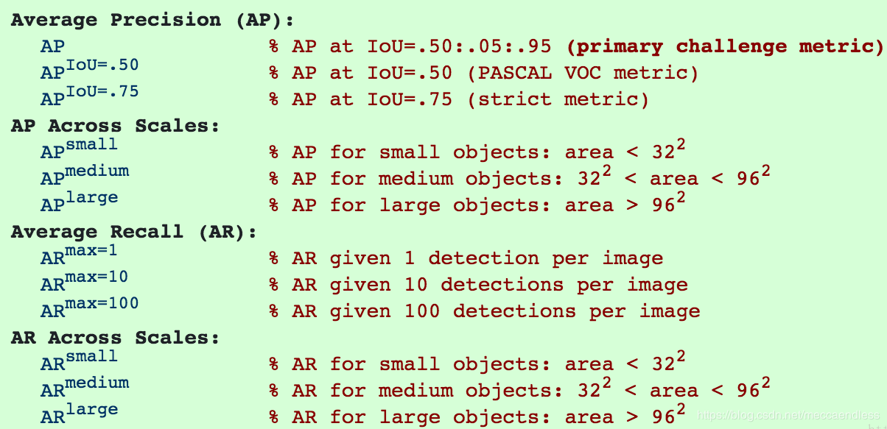

### 1.2 focal loss

focal loss：


在Focal Loss中，它更关心难分类样本，不太关心易分类样本

平衡因子alpha，用来平衡正负样本本身的比例不均。alpha取值范围0~1，当alpha>0.5时，可以相对增加y=1所占的比例。实现正负样本的平衡。

gamma>0，gamma调节简单样本权重降低的速率，何凯明的试验中，gamma为2是最优的

### 1.3 smooth L2


### 1.4 边界框回归ground truth计算


### 1.5 ROIPooling  RoIWarp RoIAlign PreciseRoI

https://blog.csdn.net/m_buddy/article/details/85110124

### 1.6 得到AUC的两种办法

随机取正负样本，正样本的预测分数大于负样本的分数的概率

### 1.6 NMS原理

它的作用是去掉检测过程中重复的框，需要**注意**的是，NMS一次处理一个类别，如果有N个类别，Non-Maximum Suppression就需要执行N次

每个框都对应一个置信度，得分越高说明越接近期望值

1. 选置信最大所对应的box，剩下的box与此计算iou
2. 将大于阈值的iou所对应的box剔除
3. 得到剩下的box的置信度，再重复1，2步，直到候选box为空

代码：

```python
import numpy as np

def py_cpu_nms(dets, thresh):
    """Pure Python NMS baseline."""
    x1 = dets[:, 0]
    y1 = dets[:, 1]
    x2 = dets[:, 2]
    y2 = dets[:, 3]
    scores = dets[:, 4]

    areas = (x2 - x1 + 1) * (y2 - y1 + 1)
    order = scores.argsort()[::-1]  # score从大到小的索引值
    # order = np.argsort(-scores)  # 也可以

    keep = []
    while order.size > 0:
        i = order[0]  # 得到第一个最大的索引值
        keep.append(i)  # 保留得分最大的索引值
        # 得到中间inter矩形的坐标
        xx1 = np.maximum(x1[i], x1[order[1:]])  # x1[i]和除了最大的值之外的值作比较
        yy1 = np.maximum(y1[i], y1[order[1:]])
        xx2 = np.minimum(x2[i], x2[order[1:]])
        yy2 = np.minimum(y2[i], y2[order[1:]])

        w = np.maximum(0.0, xx2 - xx1 + 1)
        h = np.maximum(0.0, yy2 - yy1 + 1)
        inter = w * h
        ovr = inter / (areas[i] + areas[order[1:]] - inter)  # 第i个box和其它box的iou
		
        # 大于阈值的就不管了（去除掉），小于阈值的就可能是另一个目标框，留下来继续比较
        inds = np.where(ovr <= thresh)[0]  # 返回满足条件的order[1:]中的索引值
        order = order[inds + 1]  # +1得到order中的索引值 

    return keep
```

**soft NMS**

对于稠密物体检测，当同类的两个目标距离较近时，如果使用原生的nms，就会导致其中一个目标不能被召回，为了提高这种情况下目标检测的召回率，Soft-NMS应运而生

加入了高斯惩罚，IOU越大的框，得分越低

**softer NMS**

加入第三分支，得出回归出四个位置的标准差，标准差越小，置信越高

https://blog.csdn.net/diligent_321/article/details/85859462

softer-NMS关注的是单个框的定位精度，而NMS和soft-NMS关注的是单个框的冗余性，显然关注点不同，所以softer-NMS可以和soft-NMS组合使用，此时效果更佳

[回到顶部](# 目录：)

## 2. 语义分割

### 2.1 相关研究

FCN

UNet

DeepLab 类别多

### 2.2 评价指标

PA(Pixel Accuracy)，mPA，平均像素精度。预测正确的像素占总像素的比例

IOU， mIOU，平均IOU

[回到顶部](# 目录：)

### 2.3 DICE loss

**Dice系数**, 根据 Lee Raymond Dice命名，是一种集合相似度度量函数，通常用于计算两个样本的相似度(值范围为 [0, 1])：
$$
s = \frac{2 |X \bigcap Y|}{|X| + |Y|}
$$
$|X|$和$|Y|$分别表示 X 和 Y 的元素个数，可采用直接简单的元素相加；也有采用取元素平方求和的做法。$|X \bigcap Y|$近似为预测图与 GT 分割图之间的点乘

其中，分子中的系数 2，是因为分母存在重复计算 X 和 Y 之间的共同元素的原因.

**dice loss 比较适用于样本极度不均的情况**，一般的情况下，使用 dice loss 会对反向传播造成不利的影响，容易使训练变得不稳定.

```python
smooth = 1. # 用于防止分母为0.
def dice_coef(y_true, y_pred):
    y_true_f = K.flatten(y_true) # 将 y_true 拉伸为一维.
    y_pred_f = K.flatten(y_pred)
    intersection = K.sum(y_true_f * y_pred_f)
    return (2. * intersection + smooth) / (K.sum(y_true_f * y_true_f) + K.sum(y_pred_f * y_pred_f) + smooth)

def dice_coef_loss(y_true, y_pred):
    return 1. - dice_coef(y_true, y_pred)
```


## 3. 目标跟踪

### 3.1 孪生网络


### 3.2 相关研究


# Python

## 1. python深拷贝和浅拷贝区别

※ 可变对象是指，可以修改其所指向的地址中的值。python可变数据类型有：list, dict, set

※ 不可变对象是指，所指向的地址上值是不能修改的，**如果修改了这个对象的值，那么它指向的地址就改变了**

> 在浅拷贝时，拷贝出来的**新对象的地址和原对象是不一样的**，但是**新对象里面的可变元素（如列表）的地址**和原对象里的可变元素的地址是相同的，也就是说浅拷贝它拷贝的是浅层次的数据结构（不可变元素），对象里的可变元素作为深层次的数据结构并没有被拷贝到新地址里面去，而是和原对象里的可变元素指向同一个地址，所以在新对象或原对象里对这个可变元素做修改时，两个对象是同时改变的，但是深拷贝不会这样，这个是浅拷贝相对于深拷贝最根本的区别。

浅拷贝和深拷贝出来的新对象的地址和原对象都是不一样的，区别在于，当元素中有可变数据类型时，浅拷贝的新对象中的可变数据地址和原对象中的是一样的，如果改变原对象中此元素的内容，新对象中的也会变，反之，如果当新对象中可变元素改变了，也同样会影响原对象。

```python
import copy
a=[1,2,3,4,5,['a','b']]
#原始对象
b=a  # 赋值，一个地址的两个引用
c=copy.copy(a)  # 对象拷贝，浅拷贝，改变a中可变元素的值，c中也会跟着改变
d=copy.deepcopy(a)  # 对象拷贝，深拷贝

print("a=",a,"    id(a)=",id(a),"id(a[5])=",id(a[5]))  # 1
print("b=",b,"    id(b)=",id(b),"id(b[5])=",id(b[5]))  # 2
print("c=",c,"    id(c)=",id(c),"id(c[5])=",id(c[5]))  # 3
print("d=",d,"    id(d)=",id(d),"id(d[5])=",id(d[5]))  # 4
```

结果如下：

```
a= [1, 2, 3, 4, 5, ['a', 'b']]     id(a)= 2554026259016 id(a[5])= 2554026259080
b= [1, 2, 3, 4, 5, ['a', 'b']]     id(b)= 2554026259016 id(b[5])= 2554026259080
c= [1, 2, 3, 4, 5, ['a', 'b']]     id(c)= 2554025466056 id(c[5])= 2554026259080
d= [1, 2, 3, 4, 5, ['a', 'b']]     id(d)= 2554026159432 id(d[5])= 2554025040584
```

[回到顶部](# 目录：)

## 2. 多态和鸭子类型

 鸭子类型只关注方法，不关注类型

## 3. 列表和元组的区别

https://www.jb51.net/article/164440.htm

**区别：**

1. 列表是动态数组，可以随意改变内部元素
2. 元组是静态数组，它们不可变，不可删除增加，其内部数据一旦创建便无法改变。
3. 元组缓存于Python运行时环境，这意味着我们每次使用元组时无须访问内核去分配内存。
4. 同样大小的数据，tuple 占用的内存空间更少
5. 元组中不能含有不可哈希的列表

**相同：**

元组的访问和列表相同

多个元组也可以相加

## 4. 斐波那契数列

https://www.cnblogs.com/happyfan/p/10869805.html

## 5. 装饰器


## 6. 生成器 迭代器


## 7. lambda匿名函数


[回到顶部](# 目录：)

## 8. 列表中append()和extend()方法的区别

append()接受一个参数，这个参数是任意数据类型的对象，append将这个对象添加到末尾

extend()接受一个参数，这个参数只能是序列，extend将这个序列中的内容添加到末尾。这个序列可以是列表list、元组tuple、集合set、字典dict，若为字典,则仅会将键(key)作为元素依次添加至原列表的末尾。

## 9. python中内置的数据结构有几种？

python可变数据类型有：list, dict, set

a. 整型 int、 长整型 long、浮点型 float、 复数 complex

b. 字符串 str、 列表 list、 元组 tuple

c. 字典 dict 、 集合 set

d. Python3 中没有 long，只有无限精度的 int

## 10. 类中的new和init有啥区别？

1. new的功能是在生成对象之前所做的动作，接受的参数是cls 类，必须要接一个返回对象
2. init是在对象生成之后完善对象的属性 它接受的是self 对象
3. 对象生成是在 new 里面 return （返回一个对象）
4. 故而“ 本质上 ”来说，__new__()方法负责创建实例，而__init__()仅仅是负责实例属性相关的初始化而已，执行顺序是，先new创建当前类的实例，然后init完善实例的属性

[回到顶部](# 目录：)

# 数据结构

## 1. 快速排序

https://www.cnblogs.com/happyfan/p/10529582.html

## 2. 堆排序


## 3. 二叉树

**二叉树**

★  高度为k的满二叉树的总节点数是$2^k-1$

★ 如果$n_0$是二叉树的叶节点数，二叉树中度数为2的节点数是$n_2$，则$n_0=n_2+1$

★ 在二叉树中，第$i$层的节点数最多是$2^{i-1}$

★ 完全二叉树中，假设有N个节点，此二叉树的层数为$h=\left \lfloor log_2(N+1) \right \rfloor$


[回到顶部](# 目录：)